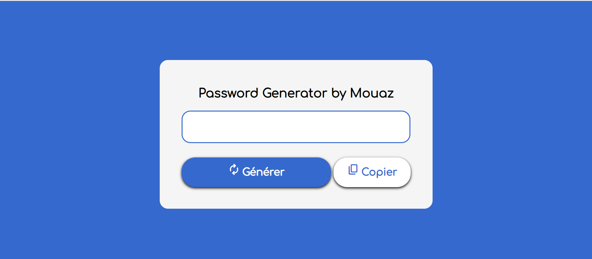
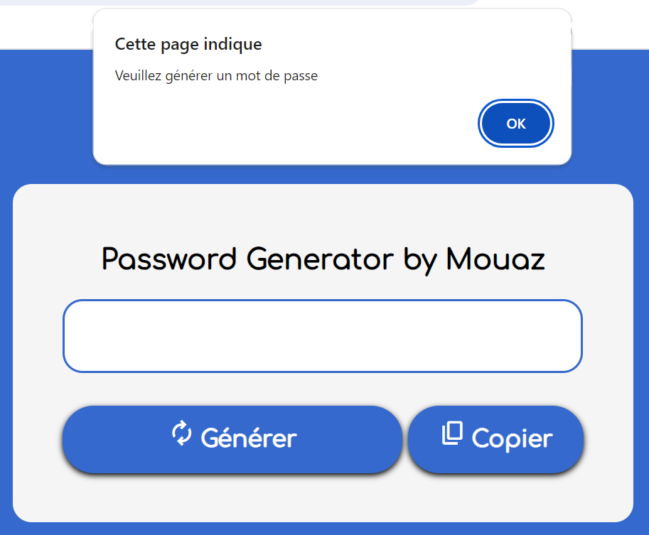
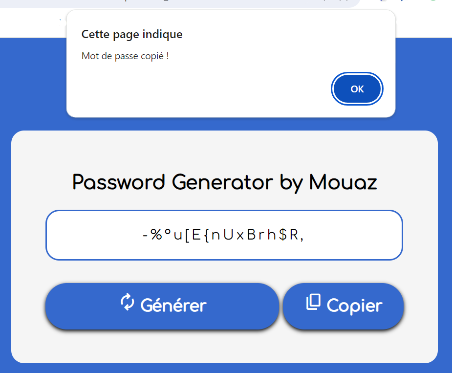
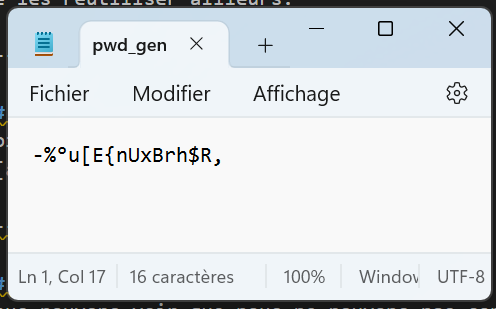

# Projet Personnel chez TiqTec (Stage) ~ Générateur de mot de passe (Password Generator) ~ Mouaz MOHAMED
Mon projet personnel est un site web développé en HTML/CSS et JavaScript permettant de générer des mots de passe robustes de 16 caractères et pouvant ainsi les copier afin de les réutiliser ailleurs.<br>
Vous pouvez accéder à mon site Web hébergé par Render : [Password Generator](https://password-generator-by-mouaz.onrender.com)

---

## Diagramme des cas d'utilisation (User Case Diagram) de mon site Web

```plantuml
left to right direction
:Utilisateur: as Utilisateur
package <uc>PasswordGenerator{
    Utilisateur --- (Générer un mot de passe robuste aléatoirement)
    Utilisateur --- (Copier le mot de passe généré)
}
```

---

## Accueil de mon site Web
Voici l'accueil de mon site Web : <br>
 <br>

---

## Copier le mot de passe sans avoir généré
Nous pouvons voir que nous ne pouvons pas copier sans avoir généré le mot de passe robuste : <br>


---

## Copier le mot de passe après avoir généré
Après avoir généré, nous pouvons copier le mot de passe où nous le souhaitons comme par exemple dans le bloc-notes : <br>
 <br>


---

## Démonstration de mon site Web


---


## Code de mon bouton Générer
```javascript
var copyBtn = document.getElementById('copy');
function generate()
{
    var chars = "0123456789abcdefghijklmnopqrstuvwxyz!@#$%^&*()+{}/~=-_\"|'`;:,<>[]µù§?£¤°ABCDEFGHIJKLMNOPQRSTUVWXYZ";
    var pwdLength = 16;
    var pwd = "";

    // Générer le mot de passe
    for(let i=0; i<pwdLength; i++)
    {
        let randomNb = Math.floor(Math.random() * chars.length);
        pwd += chars.substring(randomNb, randomNb+1);

        // Afficher le mot de passe
        document.getElementById('pwd').value = pwd;
    }
}
```

---

## Code de mon bouton Copier
```javascript
var copyBtn = document.getElementById('copy');
function generate()
{
    var chars = "0123456789abcdefghijklmnopqrstuvwxyz!@#$%^&*()+{}/~=-_\"|'`;:,<>[]µù§?£¤°ABCDEFGHIJKLMNOPQRSTUVWXYZ";
    var pwdLength = 16;
    var pwd = "";

    // Générer le mot de passe
    for(let i=0; i<pwdLength; i++)
    {
        let randomNb = Math.floor(Math.random() * chars.length);
        pwd += chars.substring(randomNb, randomNb+1);

        // Afficher le mot de passe
        document.getElementById('pwd').value = pwd;
    }
}
```